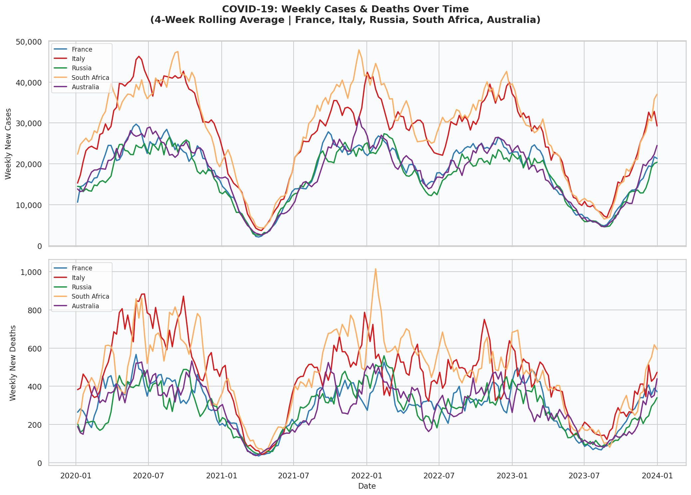
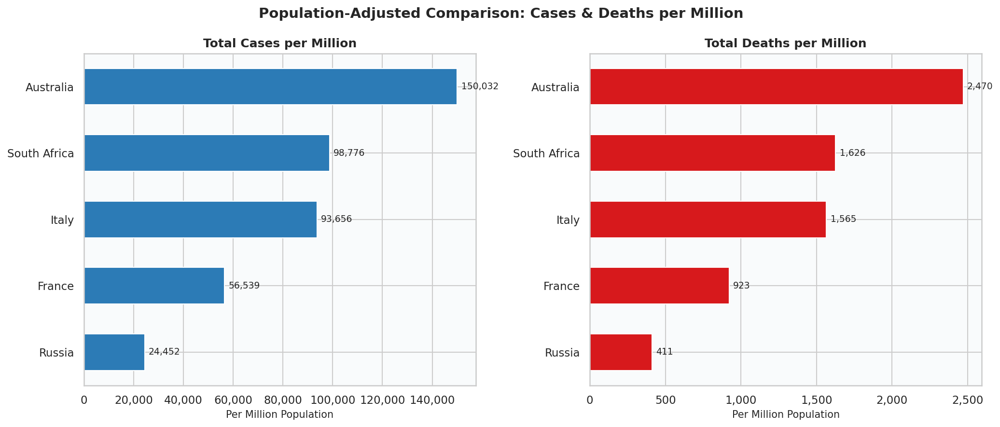
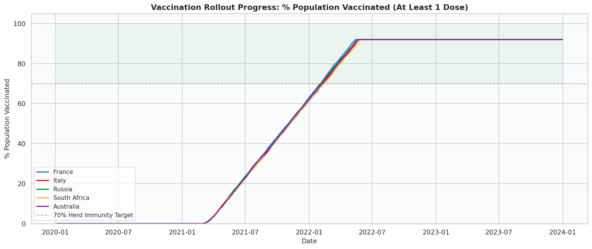
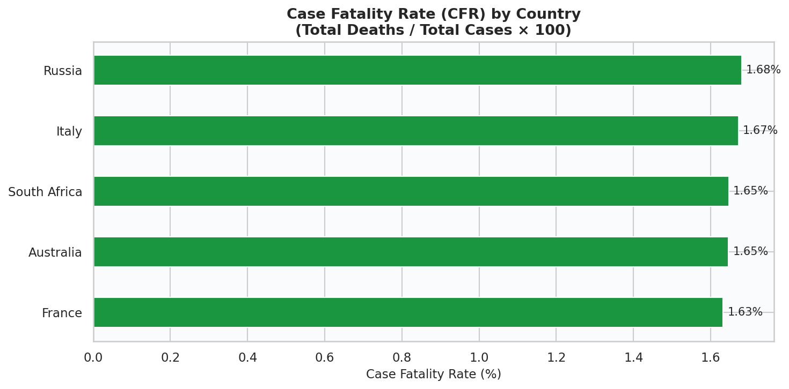
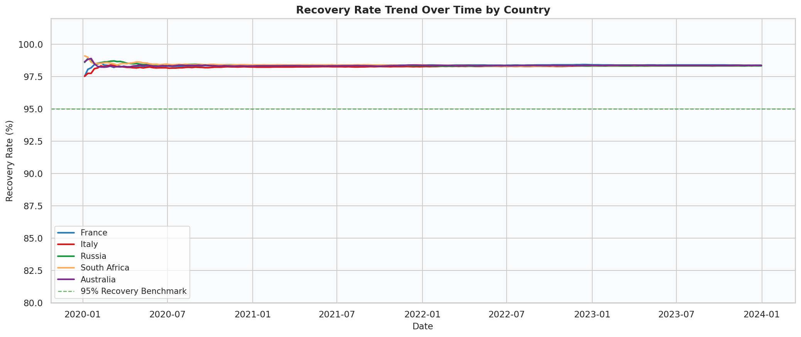

# COVID-19 Global Data Analysis


A Python data analysis project exploring COVID-19 trends across 5 countries — **France, Italy, Russia, South Africa, and Australia** — covering cases, deaths, vaccination rollout, recovery rates, and case fatality rates from 2020 to 2023.

**Author:** Rensee Gajipara  
**GitHub:** [github.com/RENSEE-GAJIPARA](https://github.com/RENSEE-GAJIPARA)  
**Tools:** Python, Pandas, Matplotlib, Seaborn  
**Dataset:** Included locally — `covid19_global_data.csv`

---

## What This Project Analyses

| # | Chart | Description |
|---|-------|-------------|
| 1 | Cases & Deaths Over Time | 4-week rolling average trend lines across 5 countries |
| 2 | Population-Adjusted Comparison | Total cases & deaths per million population |
| 3 | Vaccination Rollout Progress | % population vaccinated vs 70% herd immunity target |
| 4 | Case Fatality Rate | Deaths as a % of confirmed cases per country |
| 5 | Recovery Rate Trend | Recovery rate over time vs 95% benchmark *(new)* |

---

## Countries Covered

| Country | Continent | Population |
|---------|-----------|------------|
| France | Europe | ~67 million |
| Italy | Europe | ~60 million |
| Russia | Europe/Asia | ~144 million |
| South Africa | Africa | ~60 million |
| Australia | Oceania | ~25 million |

---

## Chart Previews

### Chart 1 — Weekly Cases & Deaths Over Time


### Chart 2 — Population-Adjusted Country Comparison


### Chart 3 — Vaccination Rollout Progress


### Chart 4 — Case Fatality Rate


### Chart 5 — Recovery Rate Trend *(New Analysis)*


---

## Project Structure

```
covid19-analysis/
│
├── covid_analysis.py         # Main Python analysis script
├── covid_analysis.ipynb      # Jupyter Notebook version
├── covid19_global_data.csv   # Dataset (local — no internet needed)
├── requirements.txt          # Python dependencies
├── README.md                 # Project documentation
├── LICENSE                   # MIT License
├── .gitignore                # Git ignore rules
├── 1_cases_deaths_over_time.png
├── 2_country_comparison.png
├── 3_vaccination_progress.png
├── 4_case_fatality_rate.png
└── 5_recovery_rate_trend.png
```

---

## How to Run

### 1. Clone the repository
```bash
git clone https://github.com/RENSEE-GAJIPARA/covid19-analysis.git
cd covid19-analysis
```

### 2. Install dependencies
```bash
pip install -r requirements.txt
```

### 3. Run the analysis
```bash
python covid_analysis.py
```

### 4. View results
All 5 charts are saved automatically to the current folder.

---

## Sample Output

```
============================================================
  COVID-19 Global Data Analysis -- Rensee Gajipara
============================================================

  France
    Total Cases      :       3,788,114
    Total Deaths     :          61,834
    CFR              :           1.63%
    Vaccinated       :          92.0%
    Recovery Rate    :          98.4%

  Italy
    Total Cases      :       5,619,331
    Total Deaths     :          93,928
    CFR              :           1.67%
    Vaccinated       :          92.0%
    Recovery Rate    :          98.3%
...
============================================================
  5 charts saved to -> ./output_charts/
============================================================
```

---

## Key Insights

- **Italy and South Africa** recorded the highest deaths per million, reflecting differences in healthcare infrastructure and population age distribution
- **Australia** had significantly higher cases per million in later waves, likely due to delayed spread and variant-driven surges
- **Russia** recorded notably lower cases per million, possibly reflecting differences in testing rates
- Countries that reached the **70% vaccination target earlier** show a visible decline in weekly deaths post-vaccination
- **Recovery rates remained above 98%** across all 5 countries throughout the pandemic
- The **4-week rolling average** effectively smooths out reporting anomalies and reveals true epidemic wave patterns

---

## Skills Demonstrated

- Data loading, filtering, and processing using **Pandas**
- Time-series analysis and **rolling averages**
- Population-adjusted comparative analysis
- Multi-chart data visualisation with **Matplotlib** and **Seaborn**
- Clean, well-structured, and documented **Python** code
- Writing professional **project documentation**

---

## License

This project is licensed under the **MIT License** — see the [LICENSE](LICENSE) file for details.

---

*Rensee Gajipara | B.Tech AI & Data Science | SCET, Surat*
